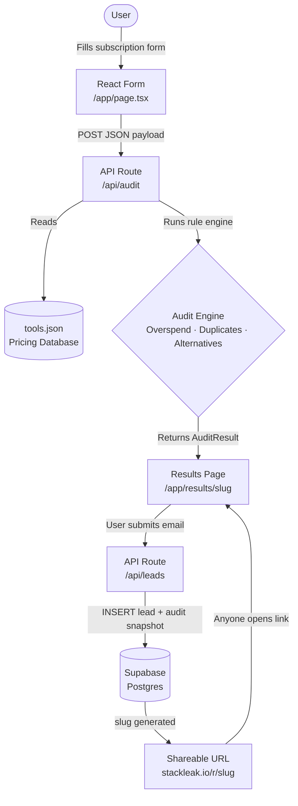

# ARCHITECTURE.md — StackLeak

> AI Spend Audit Tool · Credex Internship Assignment 

---

## 1. Recommended Stack

| Layer | Choice | Reason |
|---|---|---|
| **Frontend** | Next.js 14 (App Router) + TypeScript | SSR/SSG out of the box boosts Lighthouse Performance; App Router gives clean file-based routing; TypeScript is preferred per spec; no extra backend server needed (API Routes handle everything) |
| **Audit Engine** | Next.js API Route (`/api/audit`) | Keeps logic server-side (no bundle bloat), easy to unit test, zero cold-start on Vercel Edge Runtime |
| **Tool Pricing DB** | Static JSON (`/data/tools.json`) bundled at build time | no CMS needed; update via PR; eliminates a round-trip; easily swapped for a DB table later |
| **Lead Storage** | Supabase (Postgres) | Free tier handles thousands of leads; Row Level Security built in; real Postgres means SQL familiarity; Supabase JS client works seamlessly in API Routes |
| **Shareable URLs** | URL-encoded query params + Supabase row `slug` | No extra infra; slug stored at lead capture time; results page re-hydrates from slug on load |
| **Deployment** | Vercel | First-class Next.js support; Edge Network improves TTFB globally; Preview Deployments per PR; free tier more than sufficient |
| **Styling** | Tailwind CSS v3 | Purges unused CSS → tiny bundle → Lighthouse Performance boost; utility classes keep a solo dev fast |

---

## 2. What Changes at 10k Audits/Day

| Concern | Current (MVP) | At Scale |
|---|---|---|
| **Audit compute** | Synchronous API Route | Move to background job queue (Upstash QStash) — audit runs async, webhook updates result row |
| **Tool pricing data** | Static JSON | Migrate to a Supabase table with a cache layer (Upstash Redis, 5-min TTL) |
| **Rate limiting** | None | Vercel Edge Middleware + Upstash Ratelimit (sliding window per IP) |
| **Lead writes** | Direct Supabase insert | Connection pooling via Supabase Supavisor (already built-in at scale) |
| **Shareable URLs** | Query params / slug | No change needed — URL scheme is already stateless |
| **CDN / caching** | Vercel Edge default | Enable `stale-while-revalidate` on results pages, ISR for tool comparison pages |

---

## 3. System Diagram



---

## 4. Data Flow

The user fills out a form listing their AI subscriptions (tool name, plan tier, seat count, monthly cost). On submit, the client POSTs this payload to `/api/audit`, which cross-references a bundled `tools.json` — a curated database of AI tools with canonical pricing — to identify overpaid plans, redundant tool overlaps, and cheaper alternatives. The audit engine returns a structured `AuditResult` object (overspend amount, alternative suggestions, total monthly and annual savings) which is rendered on the results page. When the user enters their email to save or share the report, `/api/leads` writes the lead and a snapshot of the audit to Supabase and returns a unique `slug`. The shareable URL (`/r/[slug]`) re-fetches the stored snapshot from Supabase, making the results fully persistent and shareable without requiring the recipient to re-run the audit.

---

## 5. Project Structure

```
stackleak/
├── app/
│   ├── page.tsx                  # Landing + subscription input form
│   ├── results/
│   │   └── [slug]/page.tsx       # Shareable results page (SSR from Supabase)
│   └── api/
│       ├── audit/route.ts        # POST: run audit engine, return AuditResult
│       └── leads/route.ts        # POST: save lead + audit snapshot, return slug
├── components/
│   ├── SubscriptionForm.tsx      # Controlled form with dynamic row add/remove
│   ├── AuditReport.tsx           # Results renderer (savings, flags, alternatives)
│   └── LeadCapture.tsx           # Email gate modal before sharing
├── lib/
│   ├── auditEngine.ts            # Core rule engine (pure functions, unit-testable)
│   ├── supabase.ts               # Supabase client singleton
│   └── slugify.ts                # Slug generation utility
├── data/
│   └── tools.json                # Curated AI tool pricing database
├── public/
├── ARCHITECTURE.md
└── README.md
```

---

## 6. Database Schema (Supabase)

```sql
-- Leads table
CREATE TABLE leads (
  id          UUID PRIMARY KEY DEFAULT gen_random_uuid(),
  slug        TEXT UNIQUE NOT NULL,
  email       TEXT NOT NULL,
  audit_input JSONB NOT NULL,   -- raw subscription list from user
  audit_result JSONB NOT NULL,  -- full AuditResult snapshot
  monthly_savings NUMERIC(10,2),
  annual_savings  NUMERIC(10,2),
  created_at  TIMESTAMPTZ DEFAULT now()
);

CREATE INDEX idx_leads_slug ON leads(slug);
CREATE INDEX idx_leads_email ON leads(email);
```

---

## 7. Key API Contracts

### `POST /api/audit`
```ts
// Request
{ subscriptions: { tool: string; plan: string; seats: number; monthlyCost: number }[] }

// Response
{ overspend: OverspendFlag[]; alternatives: Alternative[]; monthlySavings: number; annualSavings: number }
```

### `POST /api/leads`
```ts
// Request
{ email: string; auditInput: Subscription[]; auditResult: AuditResult }

// Response
{ slug: string; shareUrl: string }
```

---

## 8. Lighthouse Strategy

| Metric | Target | Approach |
|---|---|---|
| Performance ≥ 85 | Image optimization via `next/image`; no render-blocking CSS (Tailwind purge); minimal JS bundle |
| Accessibility ≥ 90 | Semantic HTML (`<form>`, `<table>`, `<main>`); ARIA labels on all inputs; 4.5:1 color contrast minimum |
| Best Practices ≥ 90 | HTTPS enforced by Vercel; no deprecated APIs; Content Security Policy header via `next.config.js` |

---

## 9. Deployment

```
Vercel (Production)
└── GitHub main branch → auto-deploy
└── Preview URLs per PR
└── Environment variables:
    NEXT_PUBLIC_SUPABASE_URL
    NEXT_PUBLIC_SUPABASE_ANON_KEY
    SUPABASE_SERVICE_ROLE_KEY   ← server-only, for lead writes
```

---

*Built by Bhavyan Jain · Credex Internship Assignment · 2026*
